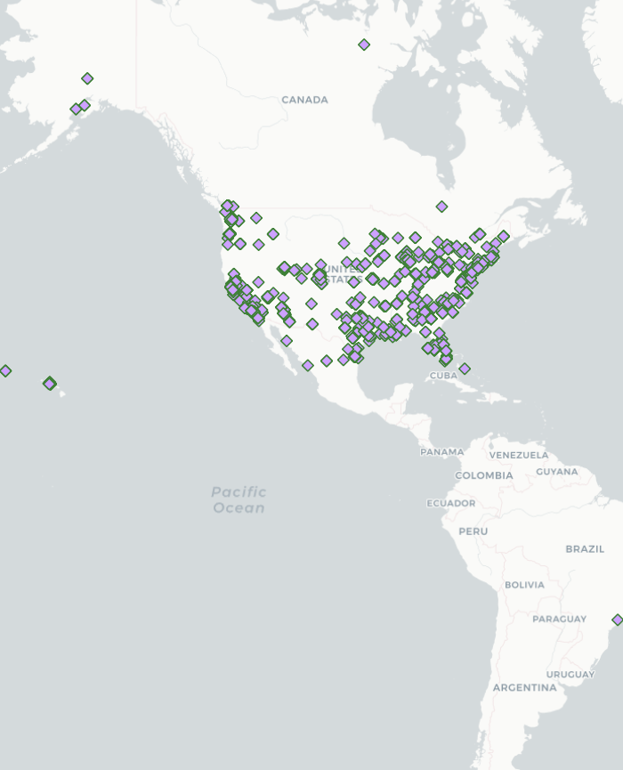
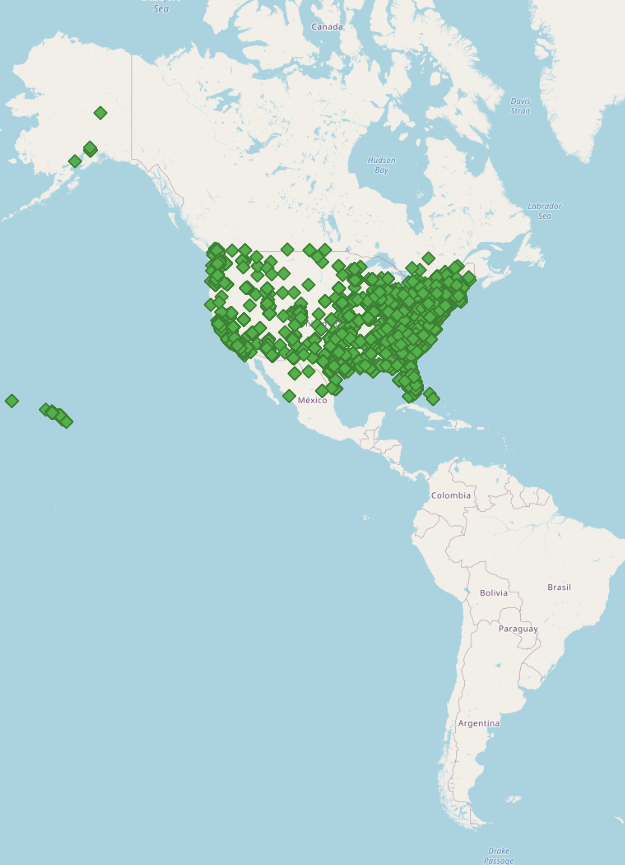
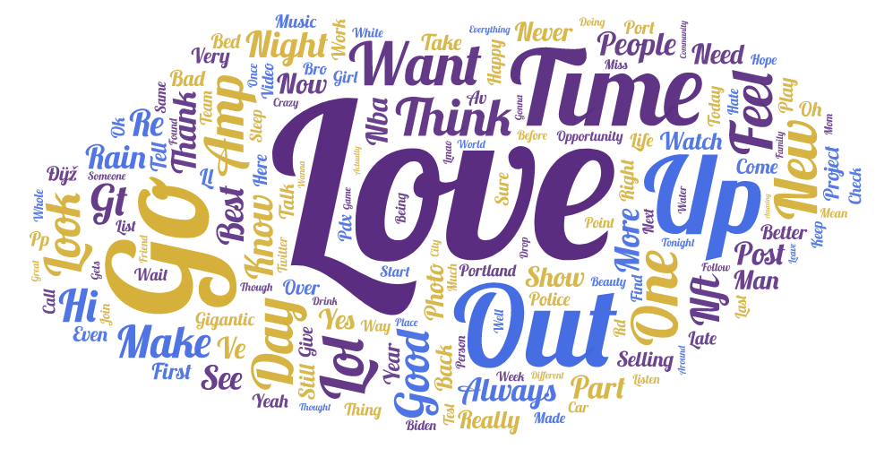
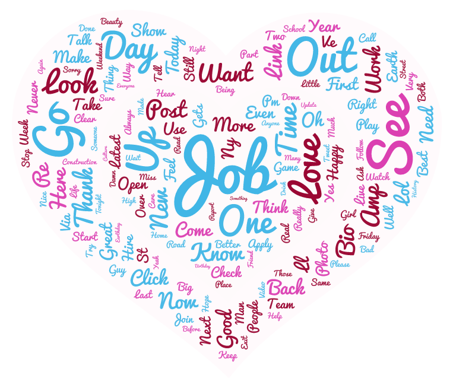

# Lab 2:  GEOG458_NBA_Geo-tagged_Tweets
## Zulkifli Sales | GEOG 458 | Professor Bo | Steven Bao

### Introducing and comparing two time periods.

For my lab 2, I wanted to focus on the USA in each of the 50 states and look at the common trends and tweets that are posted daily. I chose to focus on NBA and basketball for my filtered topics because during this time, the NBA playoffs are going and **I believed it would have been interesting to see the correlation between geospatial location and support for teams in different states and cities.** I also know that, people from different sides of the U.S. speak differently, so **I am also curious to see do the words we use in the west coast differ from the east coast?** I ran the Twitter Web Crawler for 900 seconds which was 15 minutes and let the information accumulate.

I first ran the web crawler from Professor Bo and TA Steven Bao at **12:10am on Friday, April 22nd, 2022**. This then produced the geotweets.csv file at *12:25am* with the information I needed to analyze. I wanted to see how much the results would differ from nighttime to lunch time which is typically from 11am-1pm. So, for the second time around, on the **same day** I ran the web crawler for also 15 minutes starting at **12:55pm on April 22nd, 2022** and geotweets-2.csv was created at *1:10pm* and got drastically different results which are displayed below.

### Two maps Nighttime(12:25am) vs Lunch Time (1:10pm)

#### Nighttime Visualization
First analyzing the nighttime map:
-  We can see that the points in purple scatter across the USA.
- Tweets are less prominent in locations like Hawaii and Alaska which we can see have only 2-3 tweets from those locations at night.
- Parts of Canada and one tweet from Brazil also are shown.
    - This could be from the usage of a VPN (Virtual Private Network) that allows the tweets to stay connected to an IP from the USA but still register from those locations.
- Tweets are coming from the east coast of the USA and the more it goes towards the west side, the users and tweets begin to scatter and there is more variance. 

#### Lunch Time Visualization
Second, analyzing the lunch time map:
- I noticed a drastic change in the number of tweets which I was surprised about
    - Lunch time produced a significant increase of tweets.
    - The difference between the nighttime tweets and lunch time tweets are 12-13 hours, so to see this change is interesting.
- The west coast tweets in locations such as California became more tweet dense
    - Tweets became more apparent during lunch time for west coast states.
- The east coast tweets significantly increased greater
    - Lunch time is the optimal time for tweets and covers a larger range of locations
- The tweets from east coast to west coast continue to spread meaning variance as go towards the west coast.
- Prominent locations of tweeters include
    - Florida, Washington D.C., Newark, New York, Philadelphia, and Boston. (East Coast)
    - Los Angeles, San Francisco, Seattle, and Vancouver (Canada) (West Coast)

#### Comparison of the two maps
I learned that the number of tweeters drastically change when it’s close to nighttime or midnight. Lunch Time is when most users get a break and have time to share their thoughts about their day, projects, news, etc. Lunch time will be the busiest for twitter and would be best for analyzing for future projects.

I also learned that for both maps, east coast tweeters have the upper hand and are more densely compact, whereas when you head towards the west coast, the tweeters become more scattered and unless it is Seattle, WA or Los Angeles, CA, most of the tweets are scattered around different part of the state or in different states.

Finally, to address the outliers in Canada and in Brazil, a VPN was still used to keep those devices in those locations connected to the USA IP addresses. In terms of importance, they are not too significant having little to no results/weight to the overall analysis of the USA tweeting patterns. These can be ignored in future analysis, but I thought it was quite interesting to keep in for analyzing purposes.

### Two Word Clouds (nighttime vs lunch time)

#### Nighttime word cloud
The word cloud below used geotweets.csv as the source for the text. Words such as **love, Time, out, want, think, feel** are all examples of what I would have thought nighttime tweets were about. Although the word basketball and NBA only held a weight size of 4, the words that are within the word cloud represent night thoughts.
- Through my own experience of using twitter, I notice that many people like to get vulnerable and share their emotions and thoughts for the world. This can be either their own thought and feelings they had throughout the day, or their emotions for certain shows, different ideas, dreams and aspirations, and more. Words like, *Never, Need, always, Part, Day, Go, Thank, Music, Bed* are examples of things i see on my own twitter feed when users tweet. I notice that during the nighttime, people love dreaming and these dreams often revolve around things they could have done during the *day* that they *love*, but *time* run's *out* and is quickly out before they have *time* to *think* or do what they *want*. In the previous statement, i have italicized the different words that people have used in their tweets and created a phrase that encompasses their thoughts, feelings, and emotions.
    - These words are accumulated through the tweets from all the users during the 12:25am Web crawl.
    - These words used in conjunction, can encompass nighttime tweets and is visually displayed in a word cloud.

#### Lunch Time Word Cloud.
The lunch time word cloud below was customized so that it can be distinctly different from the nighttime word cloud above. During the lunch time, we noticed words such as **Job, more, post, out, mew, go, look, day, up, talk, beauty, school want, team, etc.**. From this, I can analyze that during the day, these tweets are more catered towards the *growth and busy mindset*. When in the day, we are trained at a young age to seek information, and grow as a individual. The words above are some of the key words that have the highest size, because they hold the most weight is used the most often. Words such as **job, go, better, look, and day** are ones that show we must go to our jobs, find different ways to become more efficient and better, look at the brighter side of things and have a positive mindset throughout the day. 

Overall, we can conclude that lunch time words are more catered towards a growing, get ready, set, go mindset to take on the day's challenges and there is a common theme that we can take out of these words.

#### Comparison of two Word Clouds

Just knowing these words is not enough, but we must understand the difference between nighttime thoughts and daytime thoughts. From this we can see:
- Nighttime thoughts are leaning more winding down, reflecting over the time you've spent throughout the day, expressing any thoughts or emotions that you were not able to express earlier, and overall is more relaxing kind of tweets.
- On the opposite spectrum, we have the lunch time tweets and from what is displayed, we can see tweets that lean more towards, stay busy, stay productive, and achieve the goals that were set out from the beginning. 

Both the nighttime context and lunch time context, although they share similar features, they both tell two different stories and can be interpreted in many ways. But from my perspective, both the east coast and west coast users share similar thoughts when it comes to their night and day tweets but show different activities during various parts of the day.

